# GenAI for Good: The Misinformation and Veracity Engine
## By Calvin Nguyen, Samantha Lin, Dr. Arsanjani
## Our Info
Calvin Nguyen: <a href = "https://www.linkedin.com/in/calvin-nguyen-data/"> Linkedin </a> | <a href = "https://github.com/Neniflight"> Github </a> \
Samantha Lin: <a href = "https://www.linkedin.com/in/calvin-nguyen-data/"> Linkedin </a> | <a href = "https://github.com/Samanthalin0918"> Github </a>

* TOC
{:toc}

## Abstract
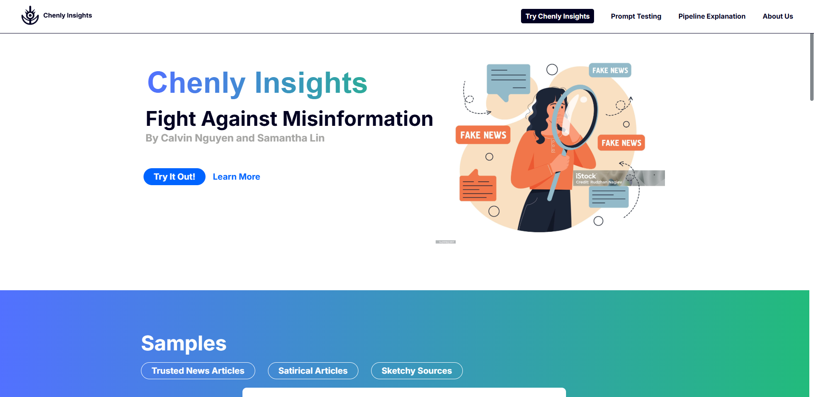 \
The objective of our product, Chenly Insights, is to help users combat misinformation using factual factors and microfactors. As misinformation gets easier to spread due to deep fakes and large social networks, this project empowers users by giving them a veracity (truthness) for the news they receive through a Mesop interface. A user will link and upload a news article of their choice. Then, two different types of AI, generative and predictive, judge the article on appropriate factuality factors. The scores are accumulated and then shown to the user, along with other visualizations related to the article. In addition, these scores, along with metadata related to the article, will be uploaded to a vector database that generative AI can use. This vector database is constantly updated with new information from fact check and news websites. Users can also converse with the AI and ask questions about each article and why a particular score was given. We also found the best prompting types with adjustments to the prompts that gives the highest accuracy.

## Dataset
We utilized multiple different data sources to both establish the ground truth and understand factors that indicate misinformation. Generally, the more context and information you give a large language model, it can give more nuanced and thoughtful judgements on a piece of text. The data is as follows: 
* **Liar Plus Dataset**: A publicly available dataset containing labeled statements from news sources with contextual information. After preprocessing, we have a dataset of 10,234 rows and 15 columns, with a key truthness labels **six levels from "pants-on-fire" to "true"**. Primarily used in our vector database and predictive AI training. \
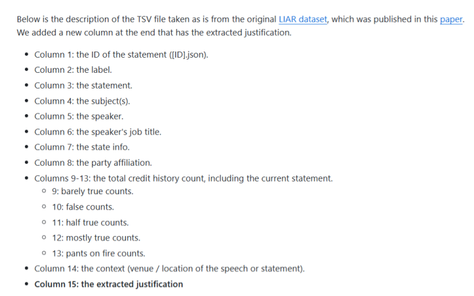 \
* **Politifact Factchecks**: A website that factchecks articles and statements made by leaders. Used to help set the ground truth of a topic.\
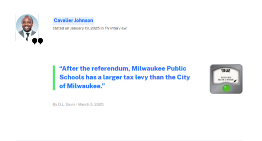 \
* **Snope Factchecks**: A website that factchecks articles and statements made on the web. \
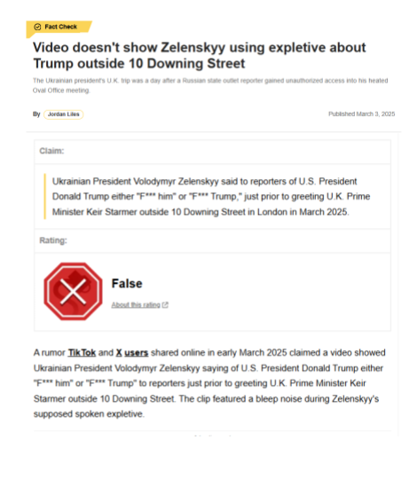 \
* **User-Selected PDFs**: Article links or PDFs are analyzed with this engine and assigned a truthness label afterwards. \
 \
* **SERP API Search Results**: Google search results based on the title of the user-selected articles to provide the veracity engine with more information.
* **Factuality Factors**: These factors determine the veracity of an article and we analyze four of them for each article: sensationalism, stance detection, social credibility, naive realism. 

## Flowchart
Our flowchart in Lucidchart showcasing the data journey thorughout this process. 

<iframe allowfullscreen frameborder="0" style="width:960px; height:720px" src="https://lucid.app/documents/embedded/7babda6c-da85-49d9-bb0c-83fd85deffdf" id="rMtVwZ9NMd.z"></iframe>

## Generative AI Methods
**Tool: Google Gemini 1.5 Pro 002**
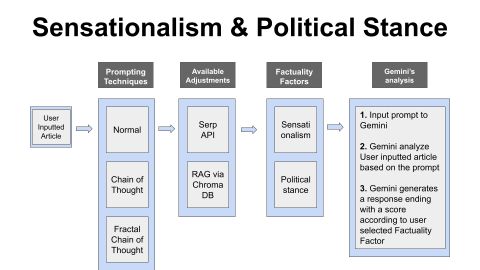 

Where and how we used it:
* Extracting key attributes from the user-uploaded text (e.g., speaker, context, title) to support predictive AI modeling.
* Evaluating sensationalism and political stance via structured prompts.

Prompting techniques and their objectives:
* **Normal prompting**: asking a baseline question for a general response from Gemini given a factuality factor.
* **Chain of Thought (CoT)**: asking the model to explain its response, allowing it to reason to get a more accurate response given a factuality factor.
* **Fractal Chain of Thought (FCoT)**: asks the model to go through iterations to explain its response and reasoning and to check what it missed on its previous iterations, to get a more well-rounded and accurate response given a factuality factor.
  
Additional information we provide to Gemini in our prompts:
* **Serp API**: search for related articles using Serp API, and use this information as a "ground truth" for Gemini to refine its evaluations.
* **RAG via ChromaDB**: Extract top three related saved contents from websites such as Politifact and Snopes by HTML parsing for Gemini to gain extra information on similar topics.

## Predictive AI Methods
**Tools: Python, HuggingFace, XGBoosted Decision Tree, Pandas, PyTorch**

Built and trained different models for different factuality factors
* **Naive Realism**: used Spacy Textblob and a HuggingFace sentiment analysis model to calculate confidence and subjectivity, and trained the model using an XGBoosted Decision Tree.
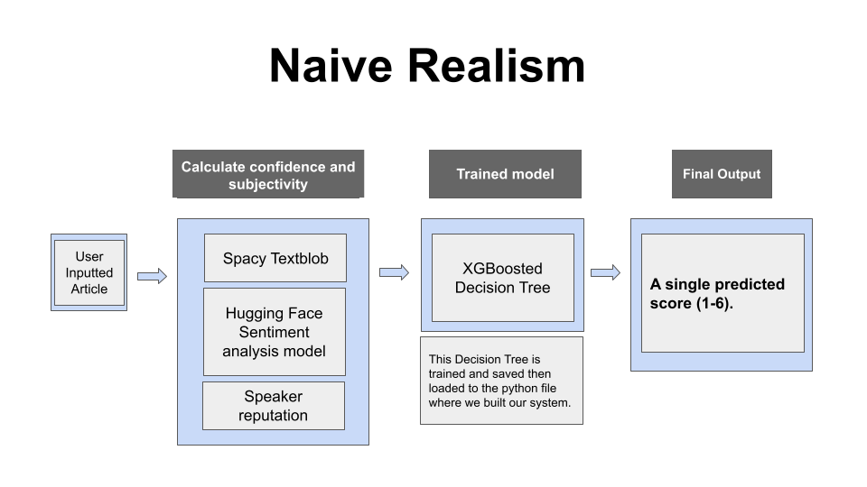 
* **Social Credibility**: Cleaned Liar Plus Dataset, one hot-encoded the speakers, context, and party affiliation, and finally built and trained a neural network model.
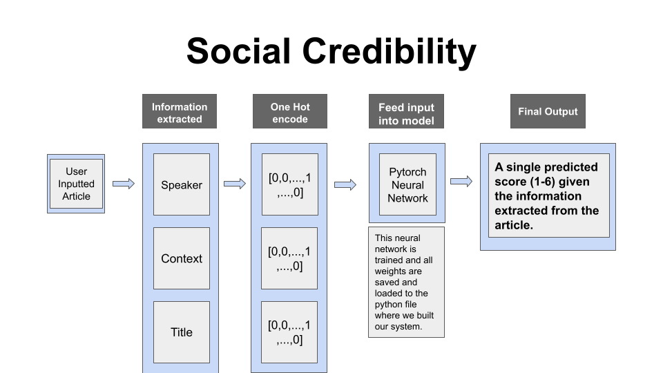 

## Website
We created a product, called Chenly Insight, a front-facting website for users to upload articles and grade them based on their perceived veracity. We utilized the predictive AI and generative AI methods listed here. If you would like to see our Figma link for the product and the poster, here it is: [Link](https://www.figma.com/design/1vaWtgLTRwwEBSDrBtEHta/DSC-180B-Designs?node-id=333-465&t=YeVJ0nUBt1QzvzpM-1). We have a couple of philosophies for our website listed below:
* Name: The name is based off the Chinese and Vietnamese word for truth, as we want our users to feel like they are discovering the truth with our product. 
* Color Scheme: We chose a blue to green color scheme and gradients, as it communicates trustworthiness and veracity. Additionally, we went with white, instead of black for our backgrounds, as our model is not a black box. We try to communicate all of the prompts and deciisons the model has made and have understand it through our deep analysis page 
* Pages: 
    * Home: Here, you can read snippets about our various sections and see example outputs of our tool on different types of articles.
    * About Us: Here, you can learn more about the team that worked behind the project, reasoning for making the project, and for reading our report. 
    * Prompt Testing: See the various prompting techniques and adjustments. You can see what examples of questions we ask to our generative AI. Addiitonally, you can upload your own article and grade them here
    * Pipeline Explanation: You can see an explanation of our pipeline, along with a lucidchart of our pipeline
    * Chenly Insights: The main tool for our product. Here, you can pick the prompting type, the adjustments you would like, and the factuality factors. After that, upload an article and then submit it for analysis. This process will take 1-2 minutes because we are asking prompts to Generative AI and running Predictive AI. Afterwards, you get results about your article and whether it is pants-on-fire to true. From there, you can choose to do a deep analysis and find more information about the article. \
    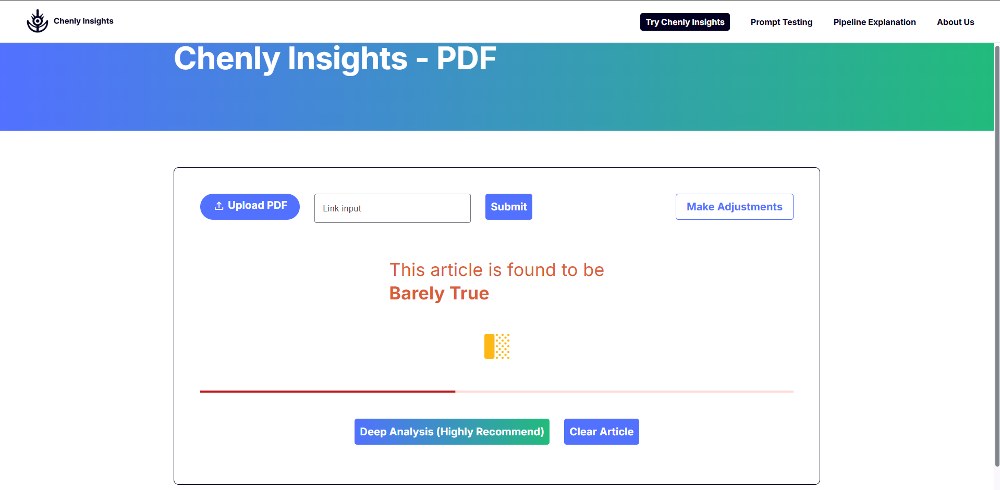 \
    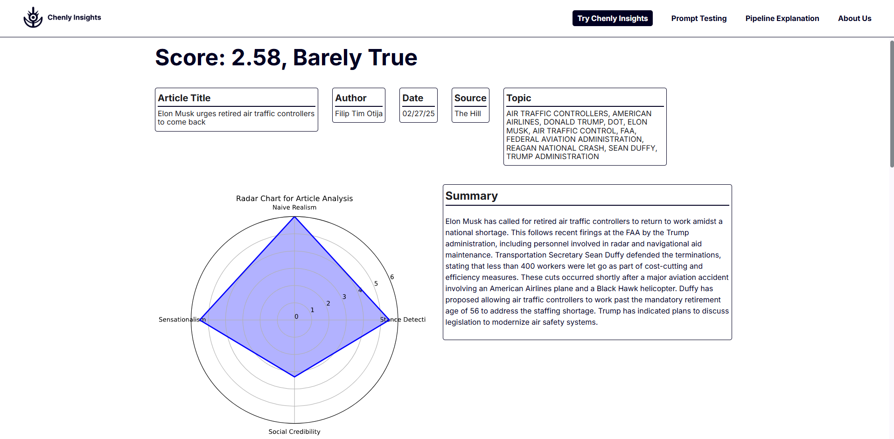 \

## Results
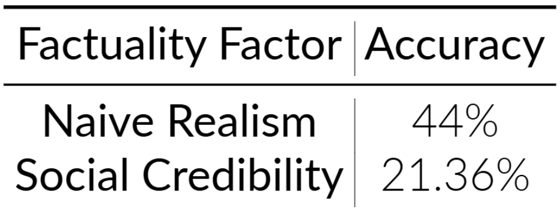 \
* Accuracy Table for two predictive AI Methods on different factuality factors\
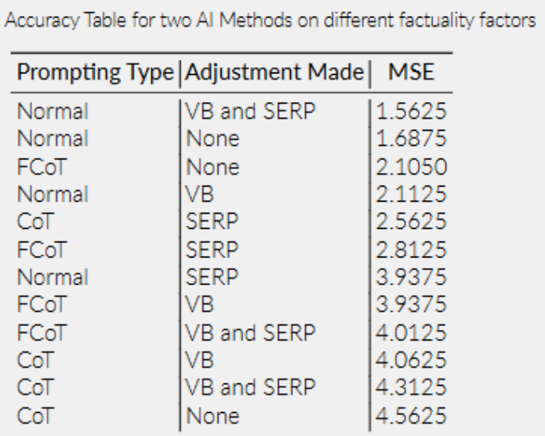 \ 
*  Prompting Types with Adjustments with their MSE\
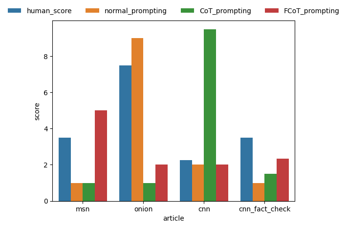\
* Scores given by human vs prompting techniques on articles bar chart

## Discussion
In our project, we've attempted to follow previous work's suggestions by combining predictive and generative artificial intelligence in detecting misinformation. We successfully developed a simple hybrid system that scores articles' veracity, and this is a significant step forward in addressing the complex challenge of misinformation in a digital age. This product can be run by anyone using our system. 

There are a couple issues with this current process though. The MSE is highly based on the human scores, which is only based on a sample size of 4. Ideally, we would like a team of 20 expert human graders to grade each article on a factuality factor to get an article’s true score.

Our hypothesis that FCoT with VB and SERP would receive the lowest MSE is wrong. Normal prompting with VB and SERP performed the best. This could be due to a couple reasons. Looking at the bar graph, it seems like FCoT struggled to judge our onion article accurately due to its satire, despite doing well for all the other articles. Additionally, we did notice that FCoT did grade each article more critically and provided more reasoning in relation to the microfactors, so it is possible that human graders did not notice that. 

## Future Direction
1. Combine generative and predictive AI for a single factuality factor using agents like CrewAI.
2. Adjust prompting techniques to help LLMs achieve more human-like scoring through longer and more specificized prompting for FCoT.
3. Expanding more data sources, such as Washington Post Fact Checker, for our vector database.
4. Make the website live via Google Cloud and a user inputted API keys and run jobs to perform automated scraping for our database. 
5. Implement more factuality factors into our model to grade articles more critically. 

## Data Ethics
**Data**:
* Liar plus dataset proven to have high-quality data according to the UC Berkeley Library.
* Politifact and Snopes are also high-quality data approved by UC Berkeley Library
* That being said, we're confident that the data used within our project creation process is ethical and accurate.

**System**:
* our system will not always provide the most accurate representation of the veracity.
* we will mention in our system to warn the users about the information and scores they get from our system will not be 100\% correct.
* Users should only use the results as a piece of information in addition to their judgment.

## Acknowledgements
Calvin and Samantha thank **Dr.Arsanjani** for his mentorship and guidance throughout this project and other groups within section B01 for debugging and advice with coding throughout the project. We would also like to thank the rest of the capstone group (David Sun, Eric Gu, Eric Sun, Jade Zhou, Luran Zhang, and Yiheng Yuan), as they helped with bouncing ideas and keeping our group accountable

## References
1. Jiang, Bohan, Zhen Tan, Ayushi Nirmal, and Huan Liu. 2024. “Disinformation Detection: An Evolving Challenge in the Age of LLMs.” arXiv preprint arXiv:2309.15847. [Link]
2. P. Qi, W. Hsu, and M. L. Lee, “Sniffer: Multimodal large language model for explainable out-of-context misinformation detection,” ar5iv, https://ar5iv.labs.arxiv.org/html/2403.03170 (accessed Nov. 3, 2024).
3. Arsanjani. Ali, ”Alternus Vera,” https://alternusvera.wordpress.com/veracity-vectors-for-disinformation-detection (accessed 2024).
4. Tariq60. 2018. “LIAR-PLUS.” Oct. [Link]